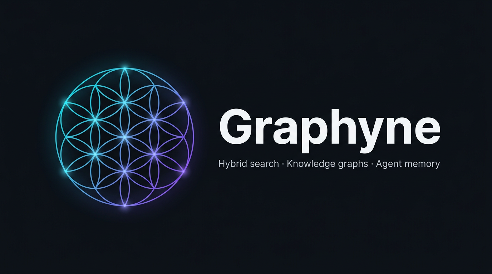

# Graphyne

*A high-performance, agent-native search and knowledge graph engine*

[]()
[]()

---

## 🎯 What is Graphyne?

Graphyne is a **high-performance, agent-native search and knowledge graph engine** written in Rust. It's designed for modern AI applications that need:

- **Hybrid retrieval** (lexical + vector + graph)
- **Agent memory management** (working, episodic, semantic, procedural)
- **GraphRAG** for enhanced reasoning
- **Production-ready** observability

---

## ✨ Core Features

### 🔍 Hybrid Search Engine

| Feature | Description | Technology |
|---------|-------------|------------|
| **Lexical Search** | BM25 scoring with FST indexing | `fst` crate |
| **Vector Search** | Approximate Nearest Neighbor (ANN) | `hnsw-rs` |
| **Graph Search** | Typed property graph with traversal | `petgraph` |
| **Hybrid Scoring** | Weighted combination of all methods | Custom scorer |

**Example Search:**
```bash
cargo run --package graphyne-cli -- search --query "AI agents" --mode hybrid --limit 10
```

### 🧠 Agent Memory System

Graphyne treats agent memory as a first-class citizen:

| Memory Type | Purpose | Retention |
|------------|---------|-----------|
| **Working** | Short-term context | Session-based |
| **Episodic** | Event-based memories | Time-based |
| **Semantic** | Factual knowledge | Permanent |
| **Procedural** | How-to knowledge | Permanent |

**Memory Features:**
- ✅ Automatic token budgeting for LLM context
- ✅ Configurable retention policies
- ✅ Importance scoring
- ✅ Graph-based memory relationships

**Store Memory:**
```bash
cargo run --package graphyne-cli -- memory store --type semantic --content "Rust is memory-safe" --importance 0.9
```

### 🕸️ Knowledge Graph & GraphRAG

| Feature | Description |
|---------|-------------|
| **GraphRAG Engine** | Generate LLM context from subgraphs |
| **Multi-hop Traversal** | Find relationships across nodes |
| **Shortest Path** | Dijkstra's algorithm implementation |
| **Centrality Analysis** | Node importance ranking |
| **Recommendations** | Graph-based suggestions |

**GraphRAG Query:**
```bash
cargo run --package graphyne-cli -- rag query --query "machine learning" --hops 2
```

### 📊 Observability & Control

| Feature | Endpoint | Format |
|---------|----------|--------|
| **Metrics** | `GET /metrics` | Prometheus |
| **Health** | `GET /health` | JSON |
| **Admin Stats** | `GET /admin/stats` | JSON |
| **Logging** | `stderr` | `tracing` |

**Available Admin Operations:**
- `POST /admin/flush` - Flush data to disk
- `POST /admin/backup` - Create backup
- `POST /admin/restore` - Restore from backup
- `POST /admin/compact` - Compact storage

### 🔌 Extensions (Optional)

| Extension | Feature Flag | Description |
|-----------|--------------|-------------|
| **Embeddings** | `embeddings` | Local embedding generation with `candle` |
| **Plugins** | `plugins` | Dynamic plugin system with hooks |
| **Web UI** | `web-ui` | Browser-based interface |

---

## 🔧 Building from Source

### Prerequisites
- Rust 1.75+ (install via [rustup](https://rustup.rs/))
- Node.js 18+ (optional, for Web UI)
- npm or yarn (optional, for Web UI)

### Build Steps
```bash
# Clone the repository
git clone https://github.com/aymenbelarbi/graphyne.git
cd graphyne

# Build all Rust crates (release mode)
cargo build --release

# Optional: Build Web UI
cd graphyne-web
npm install
npm run build
cd ..
```

---

## 🚀 Quick Start

### Running the Server
```bash
cargo run --release --package graphyne-server
```

### Using the CLI
```bash
# Search
cargo run --package graphyne-cli -- search --query "your search"

# Store memory
cargo run --package graphyne-cli -- memory store --type working --content "Remember this"
```

---

## 🧪 Running Tests

Run all tests across the workspace:
```bash
cargo test --workspace
```

For specific package tests:
```bash
cargo test --package graphyne-core
cargo test --package graphyne-server
```

---

## 📚 Documentation

- **Architecture Plan**: [`plans/comprehensive-architectural-plan.md`](plans/comprehensive-architectural-plan.md)
- **gRPC Proto**: [`graphyne-proto/proto/graphyne.proto`](graphyne-proto/proto/graphyne.proto)

---

## 🔌 API Documentation

Graphyne provides both gRPC and HTTP/JSON APIs for interacting with the system.

### gRPC API (Port 50051)
Protobuf service definitions available in [`graphyne-proto/proto/graphyne.proto`](graphyne-proto/proto/graphyne.proto)

**Available Services:**
- `SearchService` - Query, Suggest
- `DocumentService` - PushDocument, PopDocument, GetDocument
- `VectorService` - AddEmbedding, SearchVector
- `GraphService` - AddNode, AddEdge, TraverseGraph
- `MemoryService` - StoreMemory, RecallMemory
- `GraphRAGService` - Query, GetSubgraph, ExpandNode
- `AdminService` - GetStats, GetHealth, Flush, Backup, Restore, Compact

### HTTP/JSON API (Port 8080)

| Endpoint | Method | Description |
|----------|--------|-------------|
| `/v1/search` | GET | Search across collections (params: q, mode, limit) |
| `/v1/memory/store` | POST | Store a memory entry |
| `/v1/memory/recall` | GET | Recall memories (params: query, type) |
| `/v1/graph/rag/query` | POST | GraphRAG query |
| `/health` | GET | Health check |
| `/metrics` | GET | Prometheus metrics |
| `/admin/stats` | GET | Admin statistics |
| `/admin/flush` | POST | Flush data to disk |
| `/admin/backup` | POST | Create backup |
| `/admin/restore` | POST | Restore from backup |
| `/admin/compact` | POST | Compact storage |

### CLI Usage
```bash
# Search
cargo run --package graphyne-cli -- search --query "AI agents" --mode hybrid

# Store memory
cargo run --package graphyne-cli -- memory store --type semantic --content "Rust is memory-safe"

# Admin operations
cargo run --package graphyne-cli -- admin stats
cargo run --package graphyne-cli -- admin health
```

---

## 🎨 Web UI

Graphyne now includes a modern web interface built with **React + Vite + shadcn/ui** components.

### Technology Stack

| Technology | Purpose |
|------------|---------|
| **React 18** | UI framework |
| **Vite** | Build tool & dev server |
| **TypeScript** | Type-safe development |
| **Tailwind CSS** | Utility-first styling |
| **shadcn/ui** | Reusable component library |

### Features

#### 🔍 Search Page
- Hybrid search with mode selection (hybrid, lexical, vector, graph)
- Real-time search results
- Responsive design with dark theme

#### 🧠 Memory Browser
- Store memories with type selection (working, episodic, semantic, procedural)
- View stored memories
- Configure retention policies and importance scoring

#### 📊 Dashboard
- System statistics at a glance
- Stat cards: Total Searches, Total Memories, Storage Size, Uptime
- Visual indicators and trends

#### ⚙️ Settings
- Server configuration
- API endpoint management
- Feature toggles

### Quick Start

#### Development Mode
```bash
cd graphyne-web
npm install
npm run dev
```
Access at: `http://localhost:5173`

#### Production Build
```bash
cd graphyne-web
npm run build
```

The build output will be in `graphyne-web/dist/`.

#### Integration with Graphyne Server

The server automatically serves the React build when available:

```bash
# Build the web UI
./build.sh

# Start the server (serves UI at http://localhost:8080)
cargo run --package graphyne-server
```

The server's `http.rs` is configured to serve static files from `graphyne-web/dist/`.

### Build Script

Use the provided `build.sh` script for easy deployment:

```bash
chmod +x build.sh
./build.sh              # Build web UI only
./build.sh --with-server  # Build web UI + Rust server
```

### UI Components

The UI is built with shadcn/ui components:
- **Cards** - Dashboard stat cards, content containers
- **Buttons** - Actions and submissions  
- **Inputs** - Text inputs with labels
- **Textarea** - Multi-line text input
- **Tabs** - Page navigation
- **Select** - Dropdown selections
- **Badge** - Status indicators
- **Label** - Form labels

All components are styled with Tailwind CSS using a dark gradient theme (`slate-900` to `purple-900`).

---

## 🏗️ Project Structure

```
graphyne/
├── graphyne-core/        # Core engine (search, memory, graph)
├── graphyne-server/      # API server (gRPC + HTTP)
├── graphyne-client/      # Client SDK
├── graphyne-cli/         # Command-line tool
├── graphyne-proto/       # Protobuf definitions
├── graphyne-web/         # Web UI (React + shadcn/ui)
└── README.md
```

---

## 🤝 Contributing

Contributions are welcome! Please follow these steps:

1. Fork the repository
2. Create a new branch for your feature/fix
3. Write tests for your changes
4. Ensure all tests pass: `cargo test --workspace`
5. Submit a pull request with a clear description of changes

For major changes, please open an issue first to discuss the proposed changes.

---

## 📄 License

Licensed under the Apache License 2.0 - see [LICENSE](LICENSE) for details.

---

## 🌟 GitHub

[](https://github.com/aymenbelarbi/graphyne)
[](https://github.com/aymenbelarbi/graphyne)
